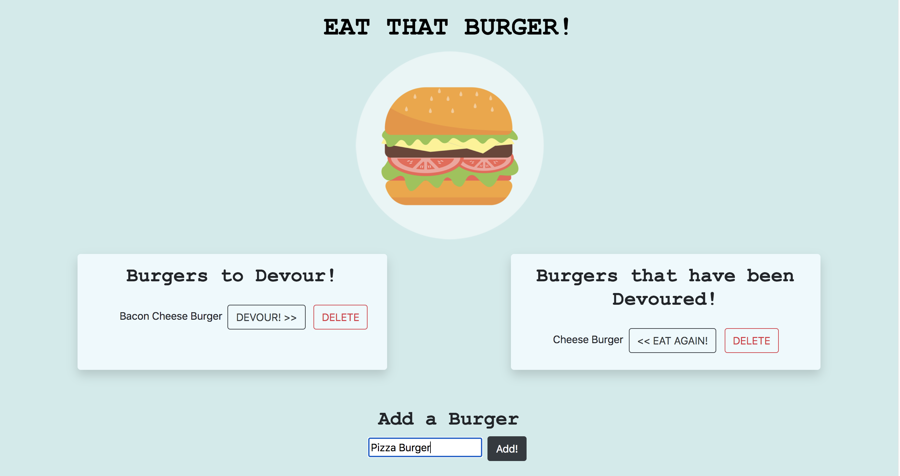
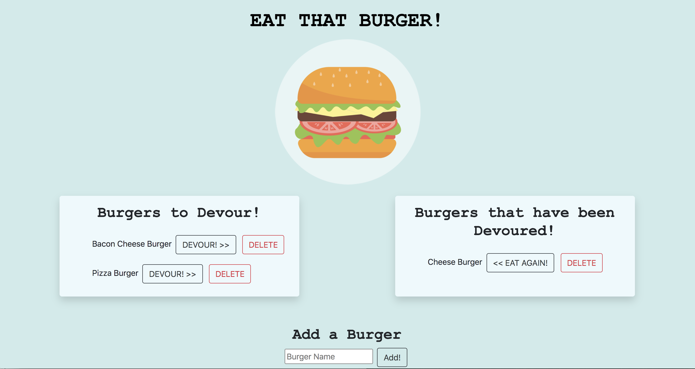
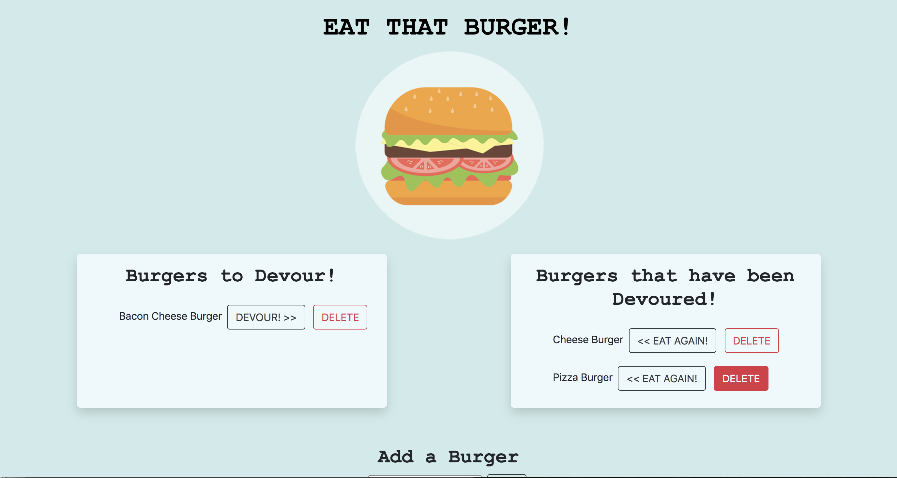

# burger

Wouldn't you love to track different burgers you've tried and which ones you'd like to try? ME TOO!

This is a simple Burger Tracker that you can use to keep track of your favorite burgers. 

Add a burger that you'd like to try!

The new burger will appear in the left hand column. You can `DEVOUR` it and it will move to the right hand column with other burgers you've tried:

If you've decided you didn't like the burger, you can delete it from the lists:

## THE CODE

Run with an <a href="https://expressjs.com/">Express.js</a> server and built with <a href="https://www.npmjs.com/package/express-handlebars">Express Handlebars</a>, the app builds the html page using 3 handlebars files: `main`, `index`, and `burger-block`.

The app uses `ORM` and an `MVC` architecture to access a <a href="https://www.mysql.com/">mySQL</a> database.

## DEPLOYMENT

The app is deployed on Heroku at <a href="https://mighty-citadel-87170.herokuapp.com/">mighty-citadel-87170.herokuapp.com</a> using their add on `JAWSDB` for the database.